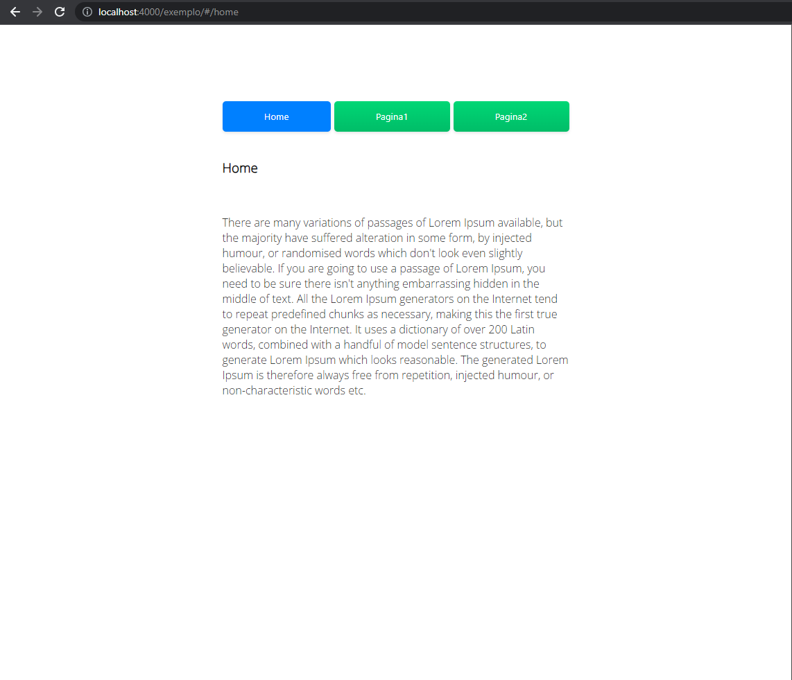
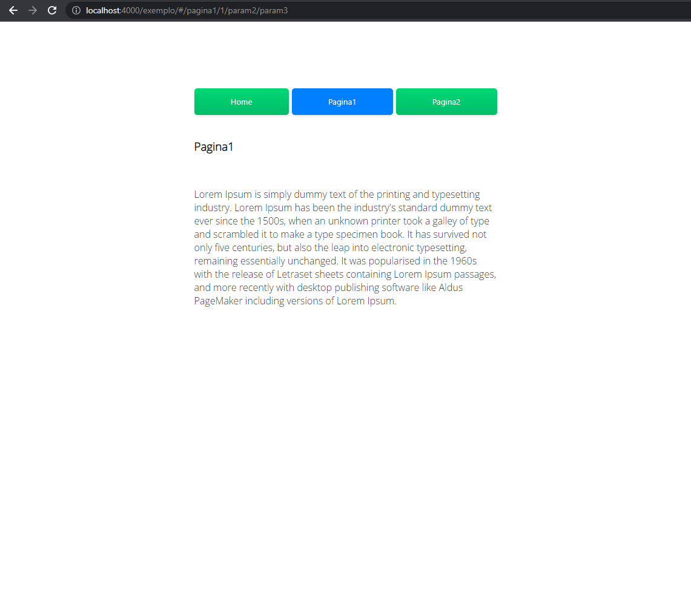
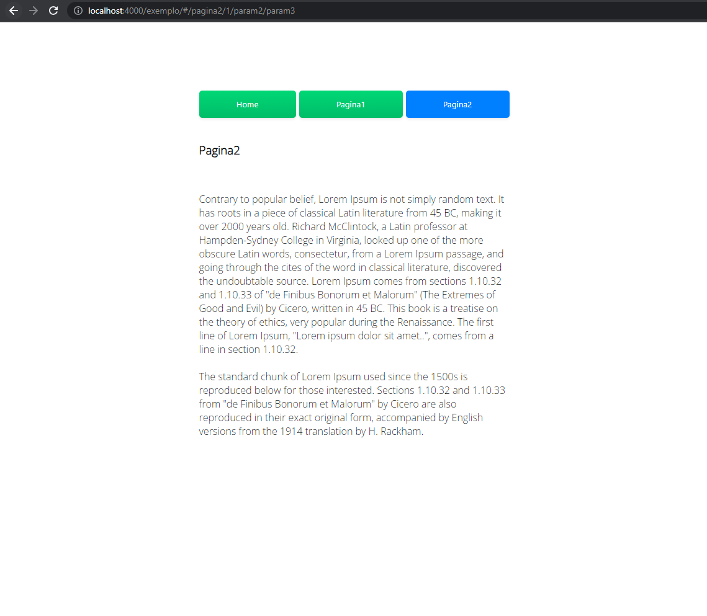

#JWC-COMPONENTS

Carregue componentes no seu HTML usando essa JavaScript já inclui sistema rota integrada, 
indicado para site de carregamento sem reflash e para quem deseja manter o seu código organizado.

#### Importação da Biblioteca jwc-components.js
Importe via CDN ou NPM 
```Terminal
npm i jwc-components
```

```html
<script src="https://cdn.jsdelivr.net/npm/jwc-components@1.1.1/jwc.js"></script>
```


#### Codigo HTML
Crie uma Tag html com nome Opcional ou escolha uma de sua preferência

```html
tagName
<my-content></my-content>

clasName
<div class="load"></div>

idName
<div id="load"></div>
```


Execução básica chame a lib passando o nome do elemento em jwc.myElement("div")
O myElement aceita 3 paramentros: TagName, Class, Id.

Para carregar o seu Componente HTML você deve criar uma pagina separada com o nome opcional Exemplo:

Html: test.html

Diretório: components.

Exemplo: components/teste.html

#### JavaScript

```javascript
jwc.myElement("my-content").component('components/test.html');
jwc.myElement(".load").component('components/test.html');
jwc.myElement("#load").component('components/test.html');
```


#### Codigo HTML
Carregamento usando Buttons com onclick=""
```html
    <div class="content"></div>

    <div class="menu">
	     <button class="btn jwc_pagina1" onclick="jwc.myElement('.content').route(this,'components','pagina1')"></div>
	     <button class="btn jwc_pagina2" onclick="jwc.myElement('.content').route(this,'components','pagina2')"></div>
	     <button class="btn jwc_pagina3" onclick="jwc.myElement('.content').route(this,'components','pagina3')"></div>
    </div>
  ```  

Outra alternativa usando Classes

#### Codigo HTML
Carregamento usando Buttons com Class
```html
    <div class="content"></div>

	<div class="menu">
		<button class="btn  jwc_click" component="component" pg="home"    content=".content">Home</button>
		<button class="btn  jwc_click" component="component" pg="pagina1" content=".content">Pagina1</button>
		<button class="btn  jwc_click" component="component" pg="pagina2" content=".content">Pagina2</button>
	</div>
  ```  


#### JavaScript
Carregamento Personalizado.

Exemplo: jwc.myElement(".load").component('folder/test.html');
```javascript
jwc.myElement("my-content").component('components/test.html');
```

#### Estado da Pagina após a Atualização do F5
Apos atualizações ta pagina a lib automaticamente já carrega a página de acordo com a URL e com isso caso você tenha clicado na página pagina3 apos apertar f5 a lib vai carregar a pagina3 e se você tiver uma classe como jwc_ + nome da pagina.html criadas exemplo jwc_pagina3 a lib adiciona uma classe do tipo jwc_active caso você tenha ela em seu css com estilo de aba clicada.

No modo usando Class não precisa colocara a classe jwc_nomePage. 

A lib ja fez isso por você. Para adicionar o jwc_active em uma pagina de preloader chame jwc.state('jwc_active', 'home');
#### JavaScript
```javascript
 //Active = Nome da sua class com estilo em css exemplo .active{background:red;}
 jwc.state('jwc_active', 'home');
```

Criar paramentros para rotas exemplo na pagina /exemplo/pagina1.html
```javascript
<script type="text/javascript">
	var url = window.location.href;
	window.location.href = url + '/1/param2/param3';
</script>
```







Nosso Site [jsaplication.com.br](https://jsaplication.com.br)
